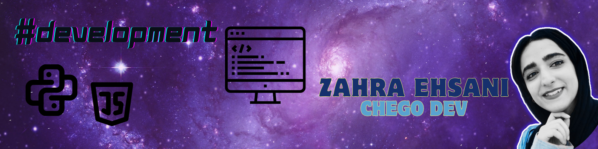

<!-- "Hero" Header -->

 

  

 

<!-- Technologies -->

## My network of programming knowledge...
  

    
    
    
    
    
    
    
    
    
     
     
     
     
     
     
      

  

<!-- GitHub -->
##
 
 

##

